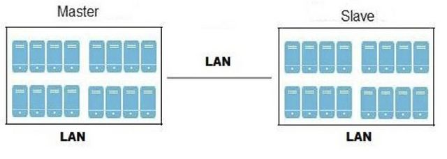
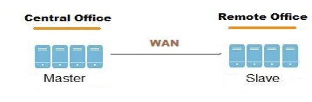
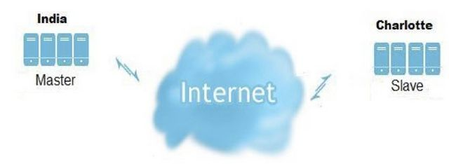

% Geo-replication User's Guide
% Gluster Documentation Team
% May 23, 2011

Synopsis
========

`volume geo-replication [<VOLNAME>] [<SLAVE-URL>] {start|stop|config|status} [options...]`

Geo-Replication Terminology
===========================

GlusterFS Geo-replication provides a continuous, asynchronous, and incremental replication service from site to another over Local Area Networks (LANs), Wide Area Network (WANs), and across the Internet.

Using GlusterFS Geo-replication, you can establish data redundancy in your storage environment, providing disaster recovery through existing LAN, WAN, and Internet connections.

GlusterFS Geo-replication uses a master–slave model, whereby replication and mirroring occurs between the following partners:

1. Master – A GlusterFS volume
2. Slave – A slave can be *local directory* or *GlusterFS Volume*. Both of the above types can be accessed remotely using *SSH* tunnel as well.

Replicated Volumes V/s Geo-replication
--------------------------------------

Both Replicated Volumes and Geo-replication mirrors data across cluster/s. In a nut-shell Replicated Volumes provide High-availability, where as Geo-replication enusres backing up of data for disaster recovery.

Replicated Volumes work on the principles of synchronous replication whereas Geo-replication is based on asynchronous replication.
That is each and every file operation is sent across all the bircks in case of the  replicated volumes, whereas the Geo-replication module checks for the changes in files periodically and syncs them if detects some difference.

Deployment Scenarios
--------------------

GlusterFS Geo-replication provides an incremental replication service over Local Area Networks (LANs), Wide Area Network (WANs), and across the Internet. This section illustrates the most common deployment scenarios for GlusterFS Geo-replication, including the following:

1. Geo-replication over **LAN**
2. Geo-replication over **WAN**
3. Geo-replication over the **Internet**
4. Multi-site **cascading** Geo-replication

Geo-replication over LAN
------------------------

You can configure GlusterFS Geo-replication to mirror data over a Local Area Network.

\

Geo-replication over WAN
------------------------

You can configure GlusterFS Geo-replication to replicate data over a Wide Area Network.

\

Geo-replication over the Internet
---------------------------------

You can configure GlusterFS Geo-replication to mirror data over the Internet.

\

Multisite cascading Geo-replication
-----------------------------------

You can configure GlusterFS Geo-replication to mirror data in a cascading fashion across multiple sites.

\

Geo-Replication Concepts
========================

Minimum Requirements
--------------------

The following table outlines the minimum requirements for both master and slave nodes within your environment:

------------------------------------------------------------------------------------------
Component                    Master                  Slave 
----------------------       ---------------------   -------------------------------------
Operating system             GNU/Linux	             GNU/Linux

Filesystem                   GlusterFS 3.2           GlusterFS 3.2 (GlusterFS needs to be
                                                     installed, but does not need to be 
                                                     running) or ext3 (any other POSIX 
                                                     compliant filesystem would work, 
                                                     but has not been tested extensively)

Python	                     Python 2.4 (with ctypes Python 2.4 (with ctypes external 
                             external module), or    module), or Python 2.5 (or higher) 
                             Python 2.5 (or higher)	

Secure shell	             OpenSSH version 4.0     SSH2-compliant daemon
                             (or higher)	 

Remote synchronization	     rsync 3.0.7 or higher   rsync 3.0.7 or higher

FUSE                         GlusterFS supported     GlusterFS supported versions
                             versions
--------------------------------------------------------------------------------------------

Setting up the Environment for Geo-replication
----------------------------------------------

**Time Synchronization**

On bricks of a geo-replication master volume, all the servers' time must be uniform. You are recommended to set up NTP service to keep the bricks sync in time and avoid out-of-time sync effect. 

*For example (Replicated setup), in a volume (master) where brick1 (12.20) is ahead of brick2 (12.10) with 10 minutes time lag. All the changes in brick2 between this period, may go unnoticed during synchronization of files with Slave*

**To setup Gluster Geo-replication for SSH**

Passowordless login has to be set up between the host machine (where geo-rep start would issued) and  the remote machine (where slave process should be launched through ssh).
On the node where geo-replication sessions are to be set up, run the following command: 

    # ssh-keygen -f /etc/glusterd/geo-replication/secret.pem
    Press Enter twice to avoid passphrase.

On an SSH slave where you want to use the account georep-user for geo-replication slave purposes, add the content of */etc/glusterd/geo-replication/secret.pem.pub* to *~georep-user/.ssh/authorized_keys file.*

**Note**: Create *~georep-user/.ssh/authorized_keys file* if it does not exist, so that only georep-user has permission to access the *.ssh* directory and its subdirectories.
As of now, georep-user must be a root or an alias of it, but this restriction will be removed in future release.

Repeat the above steps on all the slaves.

Managing Gluster-FS Geo-replication
-----------------------------------

GlusterFS Geo-replication uses a master–slave model, whereby replication and mirroring occurs between the following partners:

1. Master – A GlusterFS volume
2. Slave – A slave can be local directory or GlusterFS Volume. Both of the above types can be accessed remotely using SSH tunnel as well.

**Understanding the URI**

GlusterFS Geo-replication uses a master–slave model, whereby replication and mirroring occurs between the following partners:

- Master : A GlusterFS volume could be used as is.
- Slave  : A slave can be of the following types:
    + A local directory which can be represented as file URI like `file:///path/to/dir`. You can use shortened form, for example: `/path/to/dir`.
    + A GlusterFS Volume - GlusterFS Volume can be either a local volume or volume served by unrelated glusterd like `gluster://localhost:volname` (shortened form - `:volname`) and `gluster://host:volname` (shortened form - `host:volname`).
    + Both of the above types can be accessed remotely using SSH tunnel. To use SSH, add an SSH prefix to either a file URI or gluster type URI. For example: `ssh://root@remote-host:/path/to/dir` (shortened form - `root@remote-host:/path/to/dir`) or `ssh://root@remote-host:gluster://localhost:volname`(shortened from - `root@remote-host::volname`).

**Starting Geo-replication**

You can use the gluster command to configure and start Gluster Geo-replication in your environment.

**Note**: You may need to configure the service before starting Gluster Geo-replication. For more information, see Configuring Geo-replication.

To start Gluster Geo-replication

Start geo-replication between the hosts using the following command:

`gluster volume geo-replication <MASTER> <SLAVE> start`

For example:

    # gluster volume geo-replication Volume1 example.com:/data/remote_mirror start 
    Starting geo-replication session between Volume1 example.com:/data/remote_mirror has been successful

**Verifying Succesful Deployment**

The status of Geo-replication session[s] could be queried by issuing the following command:

`gluster volume geo-replication [<MASTER> [<SLAVE>]] status`

The output of the status query could be filtered in these possible ways:

- Display the status of all the sessions

`gluster volume geo-replication status`

- Display the status of all the sessions for a particular *Master*

`gluster volume geo-replication <MASTER> status`

- Display the status of a particular session

`gluster volume geo-replication <MASTER> <SLAVE> status`

For example: 

    # gluster volume geo-replication Volume1 example.com:/data/remote_mirror status 
    MASTER	SLAVE	                                                STATUS
    --------------------------------------------------------------------------------
    Vol1	ssh://root@192.0.32.102:gluster://127.0.0.1:slave_vol	Starting....
    Vol1	file:///tmp/geo-rep-slave-dir	                        OK

The status of a sesion could be one of the following four:

- Starting: This is the init phase of the Geo-replication module, it remains in this state for a minute, to make sure no abnormailites are present.

- OK: The geo-replication module is in a stable state.

- faulty: The geo-replication module has witnessed some abnormaility and the session, the situtation has to be investigated further. For further information refer Troubleshooting section.

- corrupt: The monitor thread which is monitoring the geo-replication the geo-replication session has died. This situation should not occur normally, if persists contact Gluster Support/Community.

**Configure**

Many aspects of Geo-replication could be configured using the Gluster commands:

`gluster volume geo-replication [<MASTER>] <SLAVE> config [options]`

The configure command could be used in the following ways for a particular session:

- Display all configuration options for a particular session

    `gluster volume geo-replication <MASTER> <SLAVE> config`

- Display the value of a particular option

    `gluster volume geo-replication <MASTER> <SLAVE> config <OPTION>`

- Set the value for a particular option

    `gluster volume geo-replication <MASTER> <SLAVE> config <OPTION> <VALUE>`

- Delete the option (Reset it to its default value)

    `gluster volume geo-replication <MASTER> <SLAVE> config !<OPTION>`

- All the logging options could be queried/set for slave:

    `gluster volume geo-replication <SLAVE> config [opt [val]]`

The configuration options could be partitioned (for the sake of visualization) into the following ways:

* General geo-replication options
    - gluster-log-file LOGFILE

        The path to the geo-replication log file.

    - gluster-log-level LOGFILELEVEL

        The log level for gluster processes.

    - log-file LOGFILE

        The path to the geo-replication log file.

    - log-level LOGFILELEVEL

        The log level for geo-replication.

    - volume-id= UID

        The command to delete the existing master UID for the intermediate/slave node. Should to be used  in a cascading setup, if you want change the loyalty of the intermediate master from the previous master.

* external utilities' options
    - gluster-command COMMAND

        The path where the gluster command is installed. Could be used if GlusterFS is installed in a custom place.

    - remote-gsyncd COMMAND

        The path where the gsyncd binary is installed on the remote machine.

    - ssh-command COMMAND

        The ssh command to use to connect to the remote machine (the default is ssh). Can be used to pass some additional options as well.

    - rsync-command COMMAND

        The rsync command to use for synchronizing the files (the default is rsync).Can be used to pass some additional options as well.

* Geo-replication internal options
These options cannot be changed(Read only), can only be queried.

    - session-owner

        The uuid of the glusterd which has intiated where the geo-replication session was started.

    - pid-file

        The file which contains pid of the gsyncd monitor which monitors and spawns the gsync sessions.

    - state-file

        The file which contains the status of geo-replication session, which would be could only be edited by the monitor thread.

Few examples:

To view list of all option/value pair, use the following command:

    # gluster volume geo-replication Volume1 example.com:/data/remote_mirror config

To get the log file for geo-replication, use the following command:

    # gluster volume geo-replication Volume1 example.com:/data/remote_mirror config log-file 

To set the log file level for Geo-replication, use the following command:

    # gluster volume geo-replication Volume1 example.com:/data/remote_mirror config log-level <LEVEL>

To view the log file for Geo-replication on slave (glusterd must be running on slave machine), use the following commands:

1.On master, run the following command: 

    # gluster volume geo-replication Volume1 example.com:/data/remote_mirror   config session-owner
    
    5f6e5200-756f-11e0-a1f0-0800200c9a66

Displays the session owner details. 

2.On slave, run the following command: 

    # gluster volume geo-replication /data/remote_mirror config log-file 
    /var/log/gluster/${session-owner}:remote-mirror.log

3.Replace the session owner details (output of Step 1) to the output of the Step 2 to get the location of the log file. 

`/var/log/gluster/5f6e5200-756f-11e0-a1f0-0800200c9a66:remote-mirror.log`

**Stopping Geo-replication**

You can use the gluster command to configure and stop Gluster Geo-replication (syncing of data from Master to Slave) in your environment.

To stop Gluster Geo-replication

Stop geo-replication between the hosts using the following command:

`gluster volume geo-replication <MASTER> <SLAVE> stop `

For example:

    # gluster volume geo-replication Volume1 example.com:/data/remote_mirror stop 
    Stopping geo-replication session between Volume1 and example.com:/data/remote_mirror has been successful

**Brick Restoration w.r.t Geo-replication**

So, when brick dies, expected behavior is that geo-rep sessions from the volume containing it go faulty, ie. you should see

    #volume geo-replication a_master status
    MASTER      SLAVE        STATUS
    -------------------------------
    a_master    :a_slave     faulty
    a_master    /other_slave faulty

To use a geo-replication slave to restore data of the fallen out brick, user is expected to make a list of his geo-rep sessions so that he can restart them when data restore is complete, then stop all geo-replication sessions with master a_master, and then insert the replacement brick by the volume replace-brick command.

Then user have to restore missing files from slave to master by a manual rsync, ie. mount master om master's host, say, on /mnt/gluster-master-tmpmount; if slave is a gluster volume, mount it on slave's host, say, on /mnt/gluster-slave-tmpmount (otherwise of course you have the file tree w/o any preparation), then on slave's host change to slave's topdir, and there perform

    rsync -PavhS --xattrs --ignore-existing ./ masterhost:/mnt/gluster-slave-tmpmount/

When this completes, time is fine for restarting the geo-rep session from master to slave. Syncing should be mild (ie. just transferring the changes in those files which were not affected, in the time window of the failure/recovery events).

Geo-Replication Rules
=====================

Best Practices
--------------

**Time Synchronization**

On bricks of a geo-replication master volume, all the servers' time must be uniform. You are recommended to set up NTP service to keep the bricks sync in time and avoid out-of-time sync effect. 

**Changing time in Bricks of Master Volume**

If the time has to be changed manually, then time must be set uniformly across the all the *Bricks*. This avoids the out-of-time sync issue described previously. Setting time backward corrupts the geo-replication index, so the recommended way to set the time manually is:

1. Stop geo-replication between the master and slave using the following command:\
    `# gluster volume geo-replication <MASTER> <SLAVE> stop`

2. Stop the geo-replication indexing using the following command:\
    `# gluster volume set <MASTER> geo-replication.indexing off`

3. Set uniform time on all bricks

4. Restart your geo-replication sessions by using the following command: \
    `# gluster volume geo-replication <MASTER> <SLAVE> start`

**Running Geo-replication commmands in one system**

It is advisable to run the geo-replication commands in one of the *Brick Server*. The rationale behind this is the log files for the geo-replication session would be stored in the *Server* where the Geo-replication start is initiated. Hence it would be easier to locate the log-files when required.

**Isolation**
Geo-replication slave operation is not sandboxed as of now and is ran as a privileged service, so security-wise it's advised to create a sandbox environment (dedicated machine / decicated vm / chroot/container type solution) by the administrator to run the geo-replication slave in it. Enhncement in this regard can be expected in followup minor rls.

Troubleshooting
---------------

**Locating the log files**

For every Geo-replication session there are at-least three log files (four if slave is a gluster volume) associated to it. `Master-log-file` is the log file for the process which monitors the *Master* volume , `slave-log-file`is the log file for process which initiates the changes in slave. `Master-gluster-log-file` for the maintainance mount pint that Geo-replication module uses to monitor the master volume, `Slave-gluster-log-file` is the slave's counterpart of it.

*Master log files*

To get the `Master-log-file` for geo-replication, use the following command:

`gluster volume geo-replication <MASTER> <SLAVE> config log-file `

To get the `Master--log-file` for geo-replication, use the following command:

    # gluster volume geo-replication Volume1 example.com:/data/remote_mirror config log-file 

*Slave log file*

To view the log file for Geo-replication on slave (glusterd must be running on slave machine), use the following commands:

1.On master, run the following command: 

    # gluster volume geo-replication Volume1 example.com:/data/remote_mirror   config session-owner
    
    5f6e5200-756f-11e0-a1f0-0800200c9a66

Displays the session owner details. 

2.On slave, run the following command: 

    # gluster volume geo-replication /data/remote_mirror config log-file 
    /var/log/gluster/${session-owner}:remote-mirror.log

3.Replace the session owner details (output of Step 1) to the output of the Step 2 to get the location of the log file. 

    `/var/log/gluster/5f6e5200-756f-11e0-a1f0-0800200c9a66:remote-mirror.log `

**FAQ's for common scenarios**

**Description**: GlusterFS Geo-replication did not synchronize the data completely but still the geo-replication status display OK.

**Solution**: You can enforce a full sync of the data by erasing the index and restarting GlusterFS Geo-replication. After restarting, GlusterFS Geo-replication begins synchronizing all the data, that is, all files will be compared with by means of being checksummed, which can be a lengthy /resource high utilization operation, mainly on large data sets (however, actual data loss will not occur). If the error situation persists, contact Gluster Support.

**Description**: GlusterFS Geo-replication output of `status` command is `OK` whereas the files don't get synced, only directories and symlink gets synced with error messages in log:

    [2011-05-02 13:42:13.467644] E [master:288:regjob] GMaster: failed to sync ./some_file`

**Solution**: GlusterFS Geo-replication invokes rsync v3.07 in the host as well as the remote machine, check if you have the desired version installed.

**Description**: GlusterFS Geo-replication output of `status` command goes to `faulty` pretty soon with a backtrace similar to this:

    2011-04-28 14:06:18.378859] E [syncdutils:131:log_raise_exception] <top>: FAIL:
    Traceback (most recent call last):
    File "/usr/local/libexec/glusterfs/python/syncdaemon/syncdutils.py", line 152, in twrap
    tf(*aa)
    File "/usr/local/libexec/glusterfs/python/syncdaemon/repce.py", line 118, in listen
    rid, exc, res = recv(self.inf)
    File "/usr/local/libexec/glusterfs/python/syncdaemon/repce.py", line 42, in recv
    return pickle.load(inf)
    EOFError

**Solution**: This primarily means that the RPC communtication between the master gsyncd module and slave gsyncd module is broken, this could happen to various reasons. Check if it satisies all the pre-requisites:

- Passwordless SSH is set up properly between the host and the remote machine.
- If FUSE is installed in the machine, since Geo-replication module mounts the GlusterFS volume using FUSE to sync data.
- If the `Slave` is a volume, check if the volume is started.
- If the `Slave` is a plain directory, check if the directory has been created already with the desired permissions.
- If Glusterfs 3.2 is not installed in the default location (in Master) and has been prefixed to be installed in a custom location, configure the `gluster-command`  for it to point to exact location
- If Glusterfs 3.2 is not installed in the default location (in slave) and has been prefixed to be installed in a custom location, configure the `remote-gsyncd-command`  for it to point to exact place where gsyncd  is located.

**Description**: In a cascading set-up, the inter-mediate master goes to faulty state with the following log:

    raise RuntimeError("aborting on uuid change from %s to %s" % \
    RuntimeError: aborting on uuid change from af07e07c-427f-4586-ab9f-4bf7d299be81 to de6b5040-8f4e-4575-8831-c4f55bd41154

**Solution**: In a cascading set-up the Intermediete master is loyal to the original primary master, the above log essentially means, that the GlusterFS Geo-replication module has detected change of primary master. If this is the desired behaviour delete the config option `volume-id` in the session initiated from the intermediate master.

